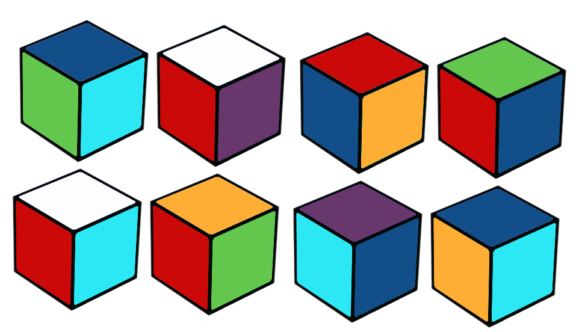
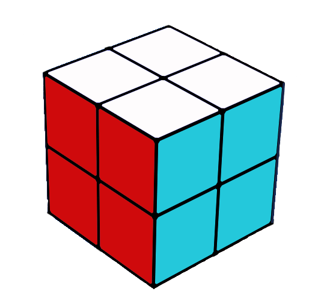
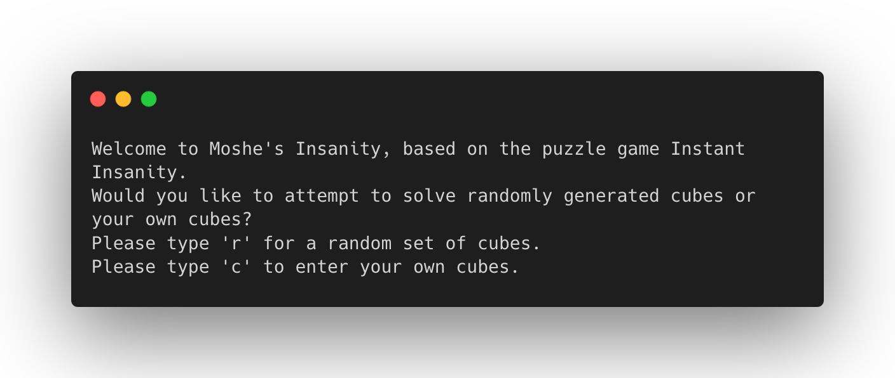
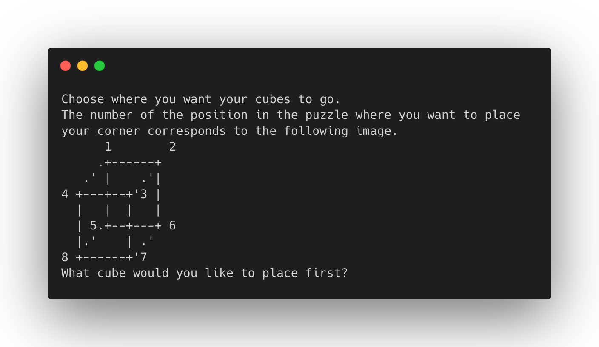

<!-- Template: https://github.com/othneildrew/Best-README-Template" -->

<!-- TITLE -->
# Solving Moshe's Insanity
Source code for a program that allows users to interact with the puzzle Moshe's Insanity. 


<!-- TABLE OF CONTENTS -->
<details open="open">
  <summary>Table of Contents</summary>
  <ol>
    <li>
      <a href="#about-the-project">About The Project</a>
      <ul>
        <li><a href="#background">Background</a></li>
        <li><a href="#goal">Goal</a></li>
        <li><a href="#main-contents-of-the-repo">Main Contents</a></li>
        <li><a href="#built-with">Built With</a></li>
      </ul>
    </li>
    <li>
      <a href="#getting-started">Getting Started</a>
      <ul>
        <li><a href="#prerequisites">Prerequisites</a></li>
        <li><a href="#installation">Installation</a></li>
      </ul>
    </li>
    <li><a href="#usage">Usage</a></li>
    <li><a href="#authors">Authors</a></li>
  </ol>
</details>


<!-- ABOUT THE PROJECT -->
## About The Project

### Background 
Moshe's Insanity is a puzzle based on the game [Instant Insanity](http://pi.math.cornell.edu/~mec/2003-2004/graphtheory/ii/howtoplayinstantinsanity.html). Created for the ACM ICPC competition in 1994, it has a relatively simple premise: 
* Given 8 cubes, arrange the cubes in a 2x2x2 arrangement so that each side of the finished puzzle are solid colors 




The constraints to the puzzle are as follows: 
* Each of the 8 cubes' six sides are colored with an individual color. No duplicate colorings may exist on a single cube. 
* The 8 cubes can include duplicates. 

### Goal 
The main goal of the project is to allow users to interact with the puzzle and see if their set of cubes is able to produce a valid puzzle. More specifically, this means we: 
* Allow the user to input their own cubes, or use a set of randomly generated ones 
* Allow the user to place their cubes into specific places in the puzzle 
* Allow the user to rotate cubes within the puzzle 
* Allow the user to see if their set of cubes is solvable 

### Main Contents of the Repo 
* Project code 
  * `main` 
    * Runs the app 
  * `model`
    * Puzzle and cube objects 
  * `controller`
    * User interaction and random cube generation 

* `matrix-exercise` 
  * Contains code to generate randomly-filled boolean 8x8 matrices: outputs to file, stdout, or in LaTeX-compilable format 
* `MavenSetup.md`
  * Instructions on how to set up Maven with VSCode 


### Built With

* [Java](https://getbootstrap.com)
* [Maven](https://jquery.com)

<!-- GETTING STARTED -->
## Getting Started

To get a local copy up and running, follow these steps.

### Prerequisites

* Java installed and on the right path 

### Installation

1. Clone the repo
   ```sh
   git clone https://github.com/marikobriggs/moshes-insanity.git
   ```
2. Enter the repo 
    ```sh 
    cd moshes-insanity 
    ```
3. Find the code 
    ```sh
    cd my-app/src/main/java
    ```
4. Compile the classes
   ```sh
   javac controller/*.java main/*.java model/*.java
   ```
5. Run the main method 
   ```sh
   java main.App
   ```

<!-- USAGE EXAMPLES -->
## Usage
After starting the program, follow the prompts. The images below show some of the prompts you'll be asked to interact with. 




<!-- CONTACT -->
## Authors

* Me, [Mariko](https://github.com/marikobriggs/)

Project Link: [https://github.com/marikobriggs/moshes-insanity](https://github.com/marikobriggs/moshes-insanity)


